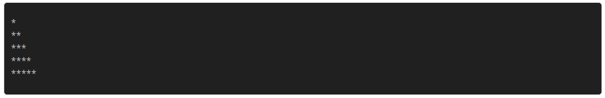
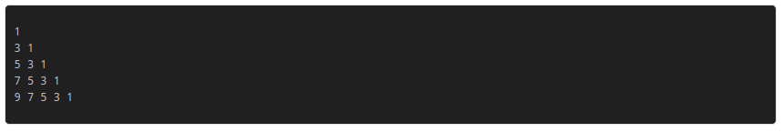

# Ejercicios de Python: Bucles

## Ejercicio 1

Escribir un programa que pida al usuario una palabra y la muestre por pantalla 10 veces

___
## Ejercicio 2

Escribir un programa que pregunte al usuario su edad y muestre por pantalla todos los años que ha cumplido (desde 1 hasta su edad)

___
## Ejercicio 3

Escribir un programa que pida al usuario un número entero positivo y muestre por pantalla todos los numeros impares desde 1 hasta ese número separados por comas

___
## Ejercicio 4

Escribir un programa que pida al usuario un numero entero positivo y muestre por pantalla la cuenta atrás desde ese numero hasta cero separados por comas 

___
## Ejercicio 5

Escribir un programa que pregunte al usuario una cantidad a invertir, el interés anual y el número de años, y muestre por pantalla el capital obtenido en la inversión cada año que dura la inversión

## Ejercicio 6

Escribir un programa que pida al usuario un número entero y muestre por pantalla un triangulo rectangulo como el de más abajo, de altura el número introducido

## Ejercicio 7

Escribir un programa que muestre por pantalla la tabla de multiplicar del 1 al 10

## Ejercicio 8

Escribir un programa que pida al usuario un número entero y muestre por pantalla un triangulo rectángulo como el de más abajo

## Ejercicio 9 

Escribir un programa que almace la cadena de caracteres **contraseña** en una variable, pregunte al usuario por la contraseña hasta que introduzca la contraseña correcta

- Utilizo el modulo *getpass* para ocultar la contraseña por terminal

